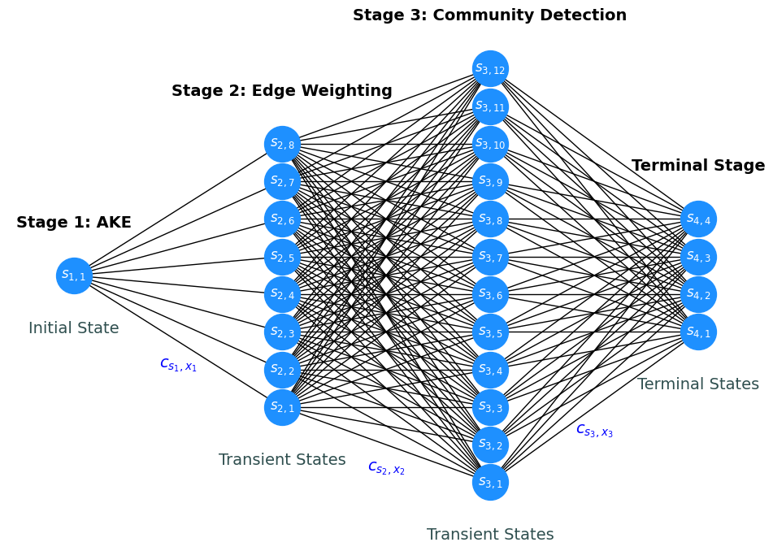

# Optimal-SNA
This repository contains the code for the paper submitted to IEEE Access:

- [A Critical Review and Process Optimization for Semantic Network Analysis](https://www.researchgate.net/publication/395768708_A_Critical_Review_and_Process_Optimization_for_Semantic_Network_Analysis)

## Summary

Semantic Network Analysis (SNA) is implemented through the key phases of Automatic Keyphrase Extraction (AKE), edge weighting, and community detection. At each stage, researchers face a set of methodological options, but previous studies have often made such choices heuristically.



The paper redefines SNA as a `Multistage Decision Process (MDP)`. For each stage, a stage-specific evaluation metric is introduced as the criterion for making evidence-based choice.

Given a dataset, the available options at each stage are evaluated with their corresponding metric, and the resulting scores are recorded. Based on these scores, `Dynamic Programming (DP)` is employed to optimize the MDP, thereby identifying the optimal combination of options.

## Table of Contents
- [Automatic Keyphrase Extraction](#automatic-keyphrase-extraction)
  - [Evaluated Methods](#evaluated-methods)
- [Edge Weighting](#edge-weighting)
  - [Evaluated Measures](#evaluated-measures)
- [Community Detection](#community-detection)
  - [Evaluated Algorithms](#evaluated-algorithms)
- [Optimization](#optimization)
- [Notes on Reproducibility](#notes-on-reproducibility)
- [Declaration of Generative AI](#declaration-of-generative-ai)
- [Citation](#citation)

## Automatic Keyphrase Extraction

The proposed approach is based on the belief that, among the many possible Semantic Networks (SNs) representing a given dataset, there exists an optimal SN.

Because the paper targets eight popular benchmark datasets, eight corresponding MDPs are optimized. Accordingly, the first stage of SNA, AKE, is applied separately for each dataset.

Below are the codes for performing AKE on each dataset and extracting the evaluation results. Unless otherwise noted in each notebook, the implementations are based on the [Python-based Keyphrase Extraction toolkit (PKE)](https://github.com/boudinfl/pke) by [Boudin (2016)](https://aclanthology.org/C16-2015/), tailored to fit our work. Some AKE methods are not included in PKE and were therefore adapted from other implementations. For their source, please refer to the text cells within the notebooks.

| Target Dataset | AKE |
|----------|----------|
| SemEval-2010  | [](https://colab.research.google.com/github/potentialreviewer/Optimal-SNA/blob/main/notebooks/AKE_for_SemEval-2010.ipynb) |
| NUS  | [](https://colab.research.google.com/github/potentialreviewer/Optimal-SNA/blob/main/notebooks/AKE_for_NUS.ipynb) |
| Inspec  | [](https://colab.research.google.com/github/potentialreviewer/Optimal-SNA/blob/main/notebooks/AKE_for_Inspec.ipynb) |
| KDD  | [](https://colab.research.google.com/github/potentialreviewer/Optimal-SNA/blob/main/notebooks/AKE_for_KDD.ipynb) |
| WWW  | [](https://colab.research.google.com/github/potentialreviewer/Optimal-SNA/blob/main/notebooks/AKE_for_WWW.ipynb) |
| SemEval-2017  | [](https://colab.research.google.com/github/potentialreviewer/Optimal-SNA/blob/main/notebooks/AKE_for_SemEval-2017.ipynb) |
| DUC-2001  | [](https://colab.research.google.com/github/potentialreviewer/Optimal-SNA/blob/main/notebooks/AKE_for_DUC-2001.ipynb) |
| 500N-KP-Crowd  | [](https://colab.research.google.com/github/potentialreviewer/Optimal-SNA/blob/main/notebooks/AKE_for_500N-KP-Crowd.ipynb) |

Here, neural-network–based AKE methods are constrained by the maximum token lengths they can process. For this reason, KeyBERT and MDERank were applied only to KDD and SemEval-2017.

### Evaluated Methods
- Statistics-based Methods
  - TF (Term Frequency)
  - TF-IDF [(Spärck Jones, 1972)](https://doi.org/10.1108/eb026526)
  - KP-Miner [(El-Beltagy and Rafea, 2009)](https://doi.org/10.1016/j.is.2008.05.002)
  - YAKE! [(Campos et al., 2020)](https://doi.org/10.1016/j.ins.2019.09.013)
- Graph-based Methods
  - TextRank [(Mihalcea and Tarau, 2004)](https://aclanthology.org/W04-3252/)
  - SingleRank [(Wan and Xiao, 2008)](https://cdn.aaai.org/AAAI/2008/AAAI08-136.pdf)
  - PositionRank [(Florescu and Caragea, 2017)](https://aclanthology.org/P17-1102/)
- NN-based Methods
  - KeyBERT [(Grootendorst, 2020)](https://github.com/MaartenGr/KeyBERT)
  - MDERank [(Zhang et al., 2022)](https://aclanthology.org/2022.findings-acl.34/)
  - LMRank [(Giarelis and Karacapilidis, 2023)](https://ieeexplore.ieee.org/document/10179894)

## Edge Weighting

By the time this second stage is reached, the AKE methods have already assigned scores to phrases in each dataset based on their respective logics. Here, depending on the target dataset, the AKE method used to extract the keyphrases, and the edge measure chosen to connect them, various SNs are constructed and evaluated.

Below are the codes for performing edge weighting and extracting the evaluation results.

| Target Dataset | Edge Weighting |
|----------|----------|
| SemEval-2010  | [](https://colab.research.google.com/github/potentialreviewer/Optimal-SNA/blob/main/notebooks/Edge_Weighting_for_SemEval-2010.ipynb) |
| NUS  | [](https://colab.research.google.com/github/potentialreviewer/Optimal-SNA/blob/main/notebooks/Edge_Weighting_for_NUS.ipynb) |
| Inspec  | [](https://colab.research.google.com/github/potentialreviewer/Optimal-SNA/blob/main/notebooks/Edge_Weighting_for_Inspec.ipynb) |
| KDD  | [](https://colab.research.google.com/github/potentialreviewer/Optimal-SNA/blob/main/notebooks/Edge_Weighting_for_KDD.ipynb) |
| WWW  | [](https://colab.research.google.com/github/potentialreviewer/Optimal-SNA/blob/main/notebooks/Edge_Weighting_for_WWW.ipynb) |
| SemEval-2017  | [](https://colab.research.google.com/github/potentialreviewer/Optimal-SNA/blob/main/notebooks/Edge_Weighting_for_SemEval-2017.ipynb) |
| DUC-2001  | [](https://colab.research.google.com/github/potentialreviewer/Optimal-SNA/blob/main/notebooks/Edge_Weighting_for_DUC-2001.ipynb) |
| 500N-KP-Crowd  | [](https://colab.research.google.com/github/potentialreviewer/Optimal-SNA/blob/main/notebooks/Edge_Weighting_for_500N-KP-Crowd.ipynb) |

However, this task generates a large number of instances (SNs), making it difficult to summarize the results qualitatively. A predictive model is needed to learn the relationships between the various features of these SNs and the target variable (evaluation criterion), along with an explanation model to interpret its predictions.

In this study, [CatBoost](https://catboost.ai/) by [Prokhorenkova et al. (2018)](https://papers.nips.cc/paper_files/paper/2018/hash/14491b756b3a51daac41c24863285549-Abstract.html) is used as the predictive model, and [SHAP](https://shap.readthedocs.io/en/latest/) by [Lundberg and Lee (2017)](https://papers.nips.cc/paper_files/paper/2017/hash/8a20a8621978632d76c43dfd28b67767-Abstract.html) is used as the explanation model. 
Additionally, the predictive model is trained by using the optimal hyperparameters identified via [Optuna](https://optuna.org/) by [Akiba et al. (2019)](https://dl.acm.org/doi/10.1145/3292500.3330701). Here is the code ([](https://colab.research.google.com/github/potentialreviewer/Optimal-SNA/blob/main/notebooks/Edge_Weighting_CatBoost.ipynb)).

### Evaluated Measures

- Frequnecy-based Measures
  - CF (Co-occurrence Frequency)
  - Dice Coefficient [(Dice, 1945)](https://doi.org/10.2307/1932409)
  - Jaccard Index [(Jaccard, 1912)](https://doi.org/10.1111/j.1469-8137.1912.tb05611.x)
- Vector-based Measures
  - Euclidean Distance
  - Manhattan Distance
  - Cosine Similarity
  - Document Mover's Distance (A Variant of the Earth Mover's Distance [(Rubner et al., 1998)](https://ieeexplore.ieee.org/document/710701)))

## Community Detection

The SNs extracted for each dataset are stored and managed in a corresponding dictionary. Subsequently, several community detection algorithms are applied to these SNs, and the results are evaluated.

In this study, Leiden is implemented by using [igraph](https://igraph.org/) [(Csárdi and Nepusz, 2006)](https://igraph.org/), whereas the remaining algorithms are implemented by using [NetworkX](https://networkx.org/) [(Hagberg et al., 2008)](https://proceedings.scipy.org/articles/TCWV9851). Here is the code ([](https://colab.research.google.com/github/potentialreviewer/Optimal-SNA/blob/main/notebooks/Community_Detection.ipynb)).

Because this task also generates a large number of instances, CatBoost, SHAP, and Optuna are used to provide a quantitative summary of the results. Here is the code ([](https://colab.research.google.com/github/potentialreviewer/Optimal-SNA/blob/main/notebooks/Community_Detection_CatBoost.ipynb)).

### Evaluated Algorithms

- Modularity-based Algorithms
  - Clauset-Newman-Moore Algorithm [(Clauset et al., 2004)](https://doi.org/10.1103/PhysRevE.70.066111)
  - Louvain Algorithm [(Blondel et al., 2008)](https://dx.doi.org/10.1088/1742-5468/2008/10/P10008)
  - Leiden Algorithm [(Traag et al., 2019)](https://doi.org/10.1038/s41598-019-41695-z)
  - Fast Label Propagation Algorithm [(Traag and Šubelj, 2023)](https://doi.org/10.1038/s41598-023-29610-z)

## Optimization

The evaluation results from each stage are recorded, enabling optimization to be performed based on these records. In this study, Dynamic Programming (Bellman, 1957) is employed as the optimization algorithm, as it is well-suited for Multistage Decision Processes. Here is the code ([](https://colab.research.google.com/github/potentialreviewer/Optimal-SNA/blob/main/notebooks/Optimization.ipynb)).

For example, according to the experiment of this study, the optimal policy for SemEval-2017 is to use KeyBERT as the AKE method, cosine similarity as the edge measure, and Leiden as the community detection algorithm. Here, $z$ is a parameter that specifies the condition for applying the edge measure (for details, refer to [the paper](https://www.researchgate.net/publication/395768708_A_Critical_Review_and_Process_Optimization_for_Semantic_Network_Analysis)).

| Target Dataset | Best AKE Method | Best Edge Measure ($z$) | Best Community Detection Algorithm | Objective Function Value |
|----------|----------|----------|----------|----------|
| SemEval-2010  | KP-Miner | Dice Coefficient ($0.75$) | Leiden Algorithm | $1.685$ |
| NUS  | KP-Miner | Cosine Similarity ($0.75$) | Clauset-Newman-Moore Algorithm | $1.900$ |
| Inspec  | LMRank | Jaccard Index ($0.50$) | Leiden Algorithm | $1.987$ |
| KDD  | KP-Miner | Jaccard Index ($0.75$) | Leiden Algorithm | $1.873$ |
| WWW  | KP-Miner | Cosine Similarity ($0.75$) | Leiden Algorithm | $1.811$ |
| SemEval-2017  | KeyBERT | Cosine Similarity ($0.25$) | Leiden Algorithm | $2.069$ |
| DUC-2001  | LMRank | Cosine Similarity ($0.75$) | Leiden Algorithm | $1.857$ |
| 500N-KP-Crowd  | TF-IDF | Cosine Similarity ($0.25$) | Leiden Algorithm | $1.880$ |

## Notes on Reproducibility

The novelty of this study lies in defining SNA as an MDP and demonstrating that an optimal policy can be identified. The presented experimental results should be understood as proofs of concept rather than carrying any meaning beyond that. Nevertheless, some readers may wish to reproduce these results. In that case, please set up your environment according to the [`requirements`](requirements) folder and then run the experiments. Using this approach, we have confirmed that reproducibility has been successful so far. Of course, due to secondary dependency issues that may arise from some of the external toolkits used, or differences in the order in which data are loaded during the training of predictive models, exact reproducibility may sometimes fail. For this reason, we have diligently saved intermediate results at each stage (see the [`data`](data) folder). These should allow reproduction in most circumstances. If problems still occur, please feel free to contact us.

## Declaration of Generative AI

The codes used in this study are fundamentally based on those we originally designed and implemented. As mentioned earlier, several external sources were also reused. However, many researchers nowadays employ `vibe coding` to identify and fix overlooked errors in their code. Likewise, we asked [ChatGPT](https://cdn.openai.com/gpt-5-system-card.pdf) to review the original codes and adopted its suggestions for improvement under our own responsibility and judgment.

## Citation

This study has been submitted to IEEE Access and is currently under review. Please wish the authors good luck, and if you need to cite it urgently, kindly refer to the [preprint](https://www.researchgate.net/publication/395768708_A_Critical_Review_and_Process_Optimization_for_Semantic_Network_Analysis).

```bibtex
@article{Ha2025,
  title={A Critical Review and Process Optimization for Semantic Network Analysis},
  author={Ha, JinWoo and Kim, Dongsoo},
  journal={unpublished},
  year={2025}
}
